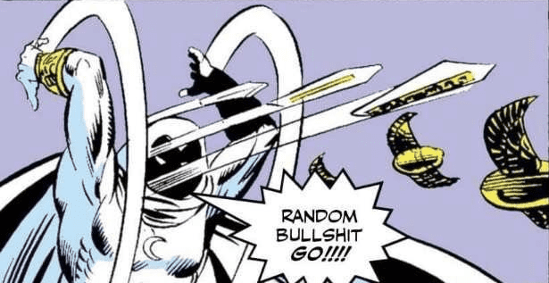
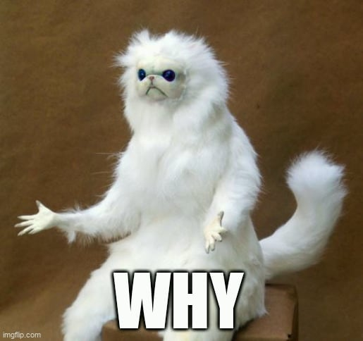
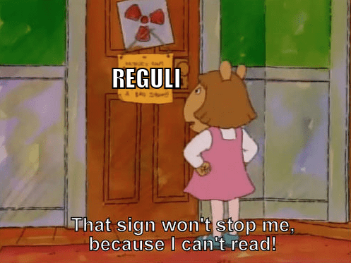

Regulament CEUAT
================

.. _argument:

Argument
--------

În România, aproape tot este ori în haos ori foarte organizat. Prin acest concurs
doresc să ajung la punctul aflat între acești doi termeni; nici organizat, nici în haos.

.. _obiective:

Obiectivele concursului
-----------------------

Concursul Elevilor Uneori ATenți nu este un concurs obișnuit (de unde vine și acronimul
„CEUAT” - Ce? What?) și nici obiectivele lui nu sunt obișnuite:

- doresc ca acest concurs să fie relaxant, ceva care aștepți să faci în weekend;
- din pricina faptului că problemele nu sunt grele, participanții au ca scop obținearea unuia sau `mai multor premii </index.html>`_, fiind necesară o creativitate sporită;

.. _reguli:

Reguli și organizarea concursului
---------------------------------

1. Se va publica un anunț pe `server-ul de Discord <https://discord.gg/mvKtP9SvZh>`_ sâmbătă la ora 13:00 (se poate modifica) o problemă de pe site-ul `pbinfo.ro <https://pbinfo.ro>`_. Aceasta trebuie să fie rezolvată în maxim o oră (+15 minute pentru încărcarea soluției finale). Se poate folosi evaluatorul platformei. În cazul în care deja aveți o soluție de 100 puncte pe contul personal, aceasta nu va fi luată în considerare și va trebui să rezolvați problema din nou.
2. Gradul de dificultate nu va fi ridicat, deci este încurajată obținerea a cât mai multor premii.
3. Va fi necesară filmarea ecranului, cu o rezoluție minimă de 640x480 pixeli și cu cel puțin 24 de cadre pe secundă. De asemenea, trebuie să fie înregistrat audio atât de la microfon cât și de la calculator. Filmarea trebuie pornită cu cel puțin două minute înainte de a începe runda. Recomand `OBS Studio <https://obsproject.com/>`_ ca program de filmat, dar nu este obligatoriu.
4. Filmările vor fi încărcate pe Google Drive sau pe YouTube.
5. Nu se va permite accesarea altor pagini web în afară de pbinfo și discord. De asemenea, se interzic manualele, caietele, documentațiile, mesajele etc. care ar putea fi folosite pentru rezolvarea problemelor.
6. Comunicarea cu alte persoane în timpul rundei este, bineînțeles, interzisă.
7. Se vor încărca maxim 10 surse (neapărat de 100 puncte pe pbinfo), dintre care prima va fi luată în cazul în care vă calificați pentru premiul de „prima soluție corectă trimisă”; dacă nu, se ia în considerare ultima sursă încărcată.
8. Link-ul către filmare trebuie pus și el într-un formular, la maxim 24 ore după rundă.
9. În general, nu trișa, have fun.

.. _antrenament:

Antrenament
-----------

Nu-ți trebuie, crede-mă.
